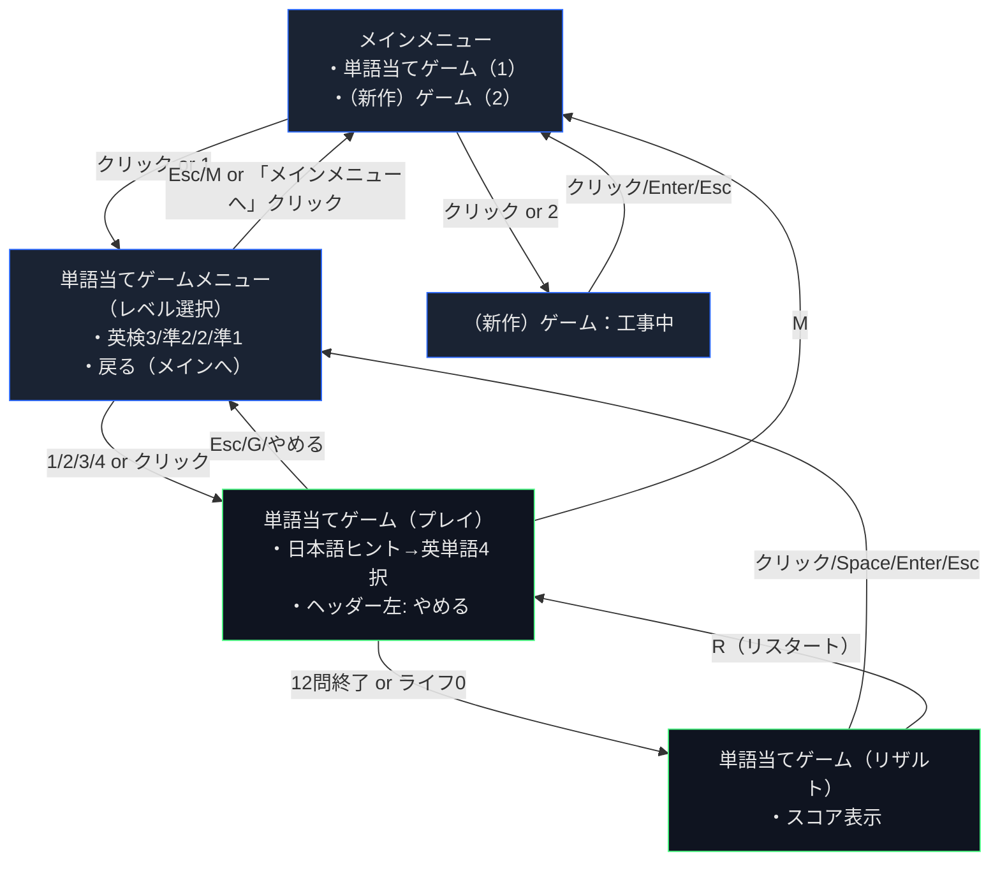

# 画面遷移図（Markdown）

## 画面定義

- メインメニュー
  - 機能: ゲーム選択
  - 項目: 単語当てゲーム（キー1）/（新作）ゲーム（キー2）
  - 遷移: クリック/キーで各ゲームへ

- 単語当てゲームメニュー（レベル選択）
  - 機能: 英検レベル選択（英検3級/準2級/2級/準1級）
  - 入力: 1〜4キー or クリックで開始
  - 戻る: Esc/M or 「メインメニューへ」クリックでメインメニューへ

- 単語当てゲーム（プレイ）
  - 機能: 日本語ヒントに合う英単語を4択からクリック
  - 進行: 判定後は クリック/Space/Enter で次の問題へ（ユーザー操作）
  - 終了: 12問終了 or ライフ0でリザルトへ
  - 戻る: Esc/G→ゲームメニュー、M→メインメニュー

- 単語当てゲーム（リザルト）
  - 表示: 「クリア！/ゲームオーバー」「スコア: n / 12」
  - 操作:
    - クリック/Space/Enter/Esc → ゲームメニューへ
    - R → 同レベルでリスタート
    - M → メインメニューへ

- （新作）ゲーム：工事中
  - 表示: 「工事中」
  - 戻る: クリック/Enter/Esc → メインメニュー

## 入力・ショートカット

- 共通
  - F4: デバッグパネル表示/非表示（初期OFF）
- 単語当てゲームメニュー
  - 1〜4: レベル選択
  - Esc/M: メインメニューへ
- 単語当てゲーム（プレイ）
  - クリック: 選択肢を選ぶ
  - 判定後の遷移: クリック/Space/Enter
  - Esc/G: ゲームメニューへ
  - M: メインメニューへ
- リザルト
  - クリック/Space/Enter/Esc: ゲームメニューへ
  - R: リスタート
  - M: メインメニューへ
- 工事中
  - クリック/Enter/Esc: メインメニューへ

## データ仕様

- 配置: `public/data/*.json`
- 形式: `[ { "jp": "日本語ヒント", "en": "英単語" }, ... ]`
- レベル:
  - 英検3級: `eiken3.json`
  - 英検準2級: `eiken_pre2.json`
  - 英検2級: `eiken2.json`
  - 英検準1級: `eiken_pre1.json`

## 表示仕様（補足）

- ヘッダー共通UI（ゲーム中）
  - 画面上部にヘッダー（100px）。左に「やめる」ボタン（押下エッジ判定）。
  - 押下でゲームメニュー（レベル選択）へ戻る。
- デバッグパネル
  - 右側に表示、F4でトグル。非表示時はゲーム領域が全幅に拡張。
- 文言（非ゲーム要素）
  - 表示は日本語（スコア/ライフ/正解/不正解/案内文/メニュー等）。
